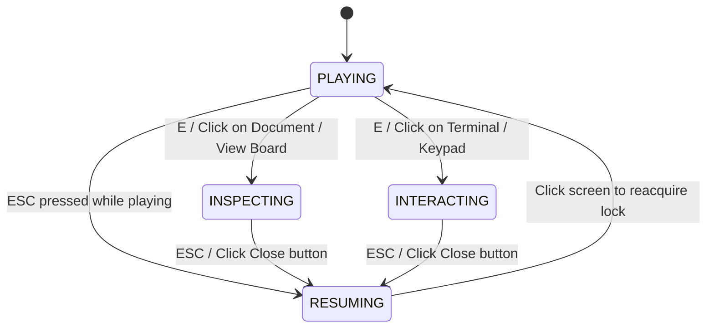

# Interaction Design & Gameplay Language

## 1. System Purpose & Core Philosophy

Auxilium uses a single, coherent first-person interaction loop designed to feel diegetic, restrained, and atmospheric:
- The player approaches a meaningful facility object or exhibit.
- When within valid standing range and looking directly at the object, a subtle reticle focus cue and contextual prompt appear: `[ E ] <Action> <Target>`.
- Pressing `E` (or clicking) activates the interaction.
- For full-screen surfaces (documents, terminals, keypads), Pointer Lock is safely released, first-person movement is locked, and a clear exit control (`[ ESC ] PUT AWAY` / `[ ESC ] CLOSE`) is provided.
- Exiting returns the game to `RESUMING` state, where clicking anywhere smoothly reacquires Pointer Lock.
- Purely decorative environmental clutter does not display prompts or fake interactions.

---

## 2. Interaction Taxonomy

Every interactable object in the facility is categorized under one of five standardized interaction types:

| Type | Action Verb | Description | Facility Examples |
| :--- | :--- | :--- | :--- |
| **`INSPECT`** | **Inspect** | A concise, one-sentence environmental observation or short audio tape. Does not trap player movement. | Desk phone, audio tape log, coffee mug, inference cluster, unusual equipment. |
| **`READ`** | **Read** | Opens a legible 2D document, memo, log, research paper, or personnel dossier in `DocumentOverlay`. | Visitor register, engineering log, sprint whiteboard memo, archive dossiers. |
| **`USE`** | **Use** | Engages a functional digital interface, console, keypad, or elevator panel. | Reception computer terminal, security keypad safe, elevator call panel. |
| **`OPEN`** | **Open** / **Close** | Toggles a physical container, desk drawer, or filing cabinet. | Reception desk drawer, personnel filing cabinet, storage safe. |
| **`VIEW`** | **View** | Inspects a large information exhibit, timeline wall, or architecture diagram, opening structured readable details. | Developer Timeline wall, Local-first systems diagram (Glass Whiteboard), Archive catalogue. |

---

## 3. Targeting Math & Spatial Arbitration

### Focus Cone & Range
- **Camera-Forward Raycast / Focus Cone:** Every frame in `PLAYING` mode, interactable objects compute the dot product between the camera forward vector and the normalized vector from camera to object:
  $$\text{focusDot} = \vec{d}_{\text{camera}} \cdot \frac{\vec{p}_{\text{target}} - \vec{p}_{\text{camera}}}{\|\vec{p}_{\text{target}} - \vec{p}_{\text{camera}}\|}$$
- **Focus Threshold:** $\text{focusDot} \ge 0.965$ (approximately a $15^\circ$ half-cone angle).
- **Default Ranges:**
  - **Standard Objects / Consoles:** $2.5\,\text{m}$
  - **Large Wall Exhibits & Boards:** $3.2\,\text{m}$ (allows comfortable standing viewing distance)
  - **Small Desk Details:** $1.8\,\text{m} - 2.5\,\text{m}$

### Candidate Arbitration & Stability
- Candidates are evaluated per render frame.
- **Priority Rules:** Higher priority value wins. When priorities are equal, the closer candidate is selected.
- **Flicker Prevention:** `InteractionController` monitors frame timestamps. If no candidate claims focus on a given frame, the active target is cleanly cleared.

---

## 4. Visual Feedback & Reticle States

The game uses a minimalist reticle and subtle object response:

```
[ IDLE ]                 [ FOCUSED ]                       [ ACTIVE / OVERLAY ]
   ·                        ( · )                              [ Hidden ]
Neutral Dot          Subtle Ring & Highlight            Reticle Hidden, Pointer Free
(Opacity 50%)       [ E ] Use Reception computer
```

### State Hierarchy:
1. **`IDLE`:** Tiny neutral dot ($1.5\,\text{px}$) in screen center, $50\%$ white opacity.
2. **`FOCUSED`:** Reticle expands slightly with a soft institutional green tint (`#d5eadf`). The focused 3D mesh undergoes a gentle, non-jarring scale response ($1.018\times$) without flashing or arcade glow.
3. **`ACTIVE`:** When an overlay (document, terminal, keypad) is open, the HUD reticle and prompt are hidden, and the cursor is visible.
4. **`DISABLED`:** Locked doors or unpowered consoles produce an unavailable tone and short feedback without opening interfaces.

---

## 5. Audio Feedback Profiles

Audio feedback is generated via lightweight Web Audio API synthesis (zero external audio file dependency, completely reliable):

| Event | Audio Profile | Tone Parameters |
| :--- | :--- | :--- |
| **Focus Target** | Subtle high-frequency pip | $520\,\text{Hz}$ sine, $25\,\text{ms}$, volume $0.015$ |
| **Activate / Use** | Confirming electronic chime | $390\,\text{Hz} \to 440\,\text{Hz}$ sine, $60\,\text{ms}$, volume $0.035$ |
| **Read Document** | Soft paper-rustle tone | $480\,\text{Hz}$ triangle/sine, $50\,\text{ms}$, volume $0.030$ |
| **Open / Drawer** | Low mechanical latch click | $260\,\text{Hz}$ sine, $80\,\text{ms}$, volume $0.040$ |
| **Close Overlay** | Muted descending tone | $190\,\text{Hz}$ sine, $50\,\text{ms}$, volume $0.025$ |
| **Unavailable** | Low rejection pulse | $120\,\text{Hz}$ sawtooth, $110\,\text{ms}$, volume $0.035$ |

---

## 6. Pointer Lock State Machine

Transitions between exploration, inspection, and resumption are strictly governed by `useGameState`:



### State Rules:
- **`PLAYING`:**
  - Pointer Lock active.
  - Movement and mouse-look enabled.
  - Reticle active, interaction detection running.
  - `E` triggers active interaction.
- **`INSPECTING` (Document / Board):**
  - Pointer Lock released (`document.exitPointerLock()`).
  - Movement and camera rotation locked.
  - 2D Document Overlay active with scrollable content and external links.
  - `Escape` or `[ ESC ] PUT AWAY` button calls `clearInteraction()`.
- **`INTERACTING` (Terminal / Keypad):**
  - Pointer Lock released.
  - Movement and camera rotation locked.
  - Interactive UI handles keyboard tabs and clicks.
  - `Escape` calls `clearInteraction()`.
- **`RESUMING`:**
  - Brief transition overlay `[ CLICK TO RESUME ]` displayed.
  - Clicking re-engages Pointer Lock and switches state back to `PLAYING`.

---

## 7. Room Interaction Contracts

| Room | Primary Interaction | Secondary / Narrative Interactions |
| :--- | :--- | :--- |
| **Reception** | `USE` Reception computer (introduces terminal UI & manifest) | `INSPECT` Desk phone (dead line)<br>`OPEN` Reception desk drawer<br>`READ` Visitor logbook |
| **Personnel Wing** | `VIEW` Developer Timeline (opens full milestone dossier) | `INSPECT` Audio tape log<br>`INSPECT` Coffee mug ("Late-night debugging sessions.")<br>`READ` Sprint whiteboard note |
| **Communications / Research** | `VIEW` Local-first systems diagram (Glass Whiteboard) | `INSPECT` Inference cluster ("Still warm.")<br>`READ` Hermes experiment memo<br>`USE` Personal archive keycard |
| **Records Hall** | `VIEW` Central archive catalogue | `READ` 2024 / 2025 / 2026 Archive dossiers<br>`OPEN` Archive filing cabinets |
| **Elevator Lobby** | `USE` Elevator call panel | `USE` Keypad safe (security access) |
| **Sublevel** | `USE` Return elevator panel | `USE` Master facility map |
